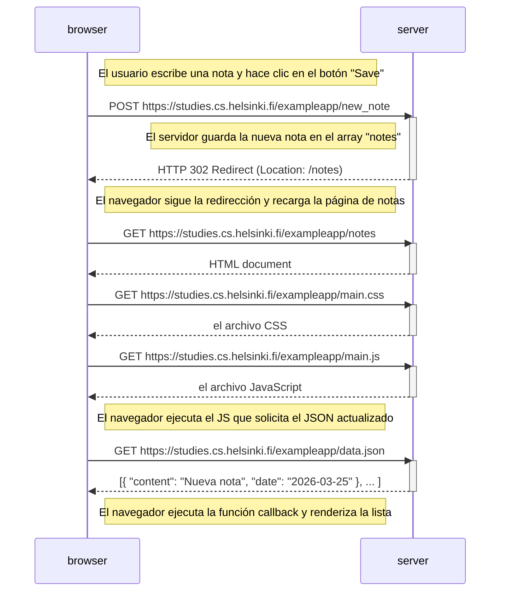

# Ejercicio 0.4: New note diagram

```mermaid
sequenceDiagram
    participant browser
    participant server

    Note right of browser: El usuario escribe una nota y hace clic en el botón "Save"

    browser->>server: POST https://studies.cs.helsinki.fi/exampleapp/new_note
    activate server
    Note left of server: El servidor guarda la nueva nota en el array "notes"
    server-->>browser: HTTP 302 Redirect (Location: /notes)
    deactivate server

    Note right of browser: El navegador sigue la redirección y recarga la página de notas

    browser->>server: GET https://studies.cs.helsinki.fi/exampleapp/notes
    activate server
    server-->>browser: HTML document
    deactivate server

    browser->>server: GET https://studies.cs.helsinki.fi/exampleapp/main.css
    activate server
    server-->>browser: el archivo CSS
    deactivate server

    browser->>server: GET https://studies.cs.helsinki.fi/exampleapp/main.js
    activate server
    server-->>browser: el archivo JavaScript
    deactivate server

    Note right of browser: El navegador ejecuta el JS que solicita el JSON actualizado

    browser->>server: GET https://studies.cs.helsinki.fi/exampleapp/data.json
    activate server
    server-->>browser: [{ "content": "Nueva nota", "date": "2026-03-25" }, ... ]
    deactivate server

    Note right of browser: El navegador ejecuta la función callback y renderiza la lista
```
